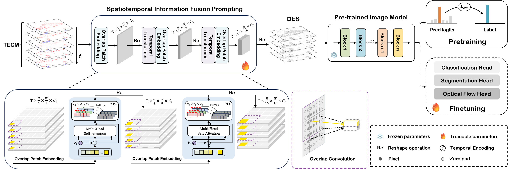

## Efficient Event Camera Data Pretraining with Adaptive Prompt Fusion<br><sub>PyTorch Implementation of the ICCV 2025 paper</sub><br><sub> [Supp](docs/STP_supp.pdf)  </sub><br>

<p align="left">
    
  <br>
</p>

## Getting Started

#### Requirement
* python 3.8
* numpy 1.24.1
* torch 1.11.0
* torchvision 0.10.1
* pytorch_lightning 1.6.4
* einops 0.4.0
* timm 0.9.2
* flatten_dict 0.4.2


#### Datasets
* [N-ImageNet dataset](https://github.com/82magnolia/n_imagenet). The expected file sturctures are shown below. 
```
└───N_Imagenet
    └───/extracted_train/n******/***.npz
    │
    └───/extracted_val/n******/***.npz
```


#### Pre-training

- Run the following code:

```
python train.py --opt config/ours/pr_vits.yml --gpus 8 --num_nodes 1

``` 


## Acknowledgement
Most of the code is borrowed from:
* https://github.com/82magnolia/n_imagenet
* https://github.com/Yan98/Event-Camera-Data-Pre-training
* https://github.com/Yan98/Event-Camera-Data-Dense-Pre-training


## Citation
If you find this code useful, please consider citing:

```
@inproceedings{liang2025efficient,
  title={Efficient Event Camera Data Pretraining with Adaptive Prompt Fusion},
  author={Liang, Quanmin and Li, Qiang and Liu, Shuai and Cao, Xinzi and Lu, Jinyi and Yang, Feidiao and Zhang, Wei and Huang, Kai and Tian, Yonghong},
  booktitle={Proceedings of the IEEE/CVF International Conference on Computer Vision},
  pages={8656--8667},
  year={2025}
}
```
